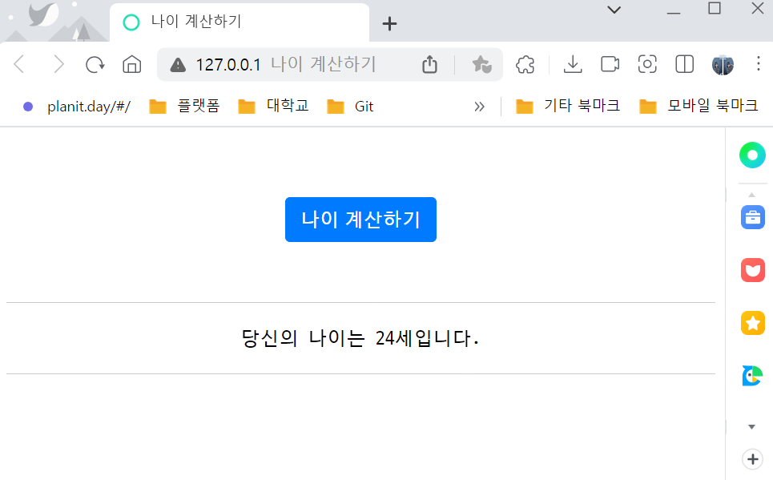
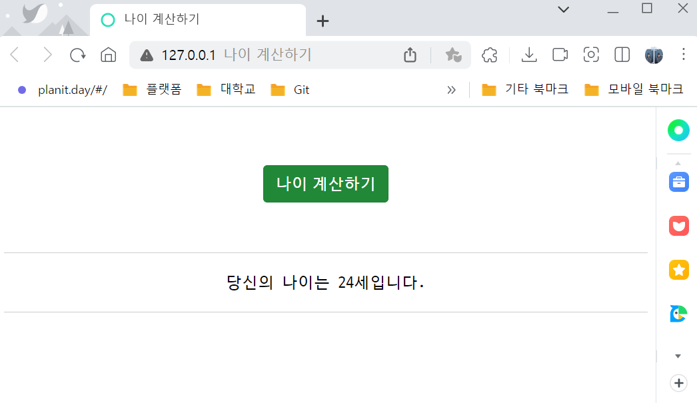
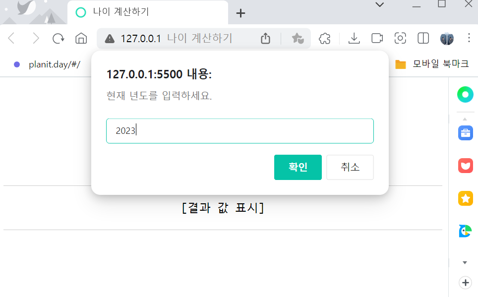
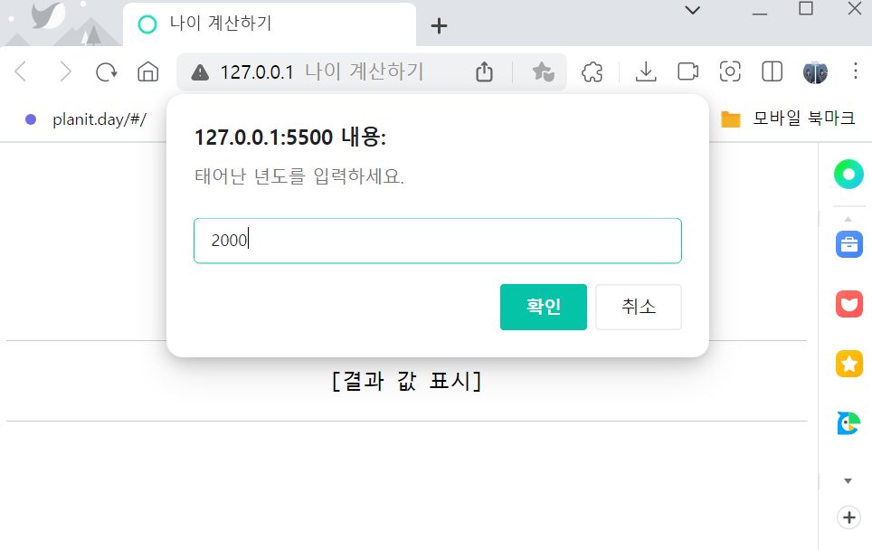

# 🚀 나이 계산 프로그램 만들기
나이 계산하기 버튼을 생성하고, 클릭 시 자바스크립트가 작동되는 프로그램을 생성합니다.  <br>
<br>


## 🔑 첫 번째 js 코드 
버튼을 클릭했을 때, onclick에 설정한 `calc` 함수가 실행되고, 기본으로 지정한 올해 년도와 태어난 년도를 확인하여 현재 나이를 계산하여 html의 result id 태그에 데이터를 삽입합니다. 

```js
// 버튼을 클릭했을 때, onclick에 설정한 calc 함수 실행 
function calc() {
  var currentYear = 2023;   // 올해 연도를 저장할 변수
  var birthYear = 2000;     // 태어난 연도를 저장할 변수
  var age;                  // 계산한 나이를 저장할 변수 

  // 올해 연도에서 태어난 연도를 뺀 다음 1을 더하여 age에 저장
  age = currentYear - birthYear +1; 

  // 문서(document)에서 선택자를 사용하여, (querySelector) id 값이 result인 태그("#result")를 선택하고 HTML에 삽입(innerHTML)
  // querySelector : 괄호 속에 제공한 선택자와 일치하는 문서 내 첫 번째 Element를 반환
  document.querySelector("#result").innerHTML ="당신의 나이는 "+ age +"세입니다.";
}
```
<br>

### 💻 결과화면
- `나이 계산하기 버튼 클릭 전 웹페이지 화면` / `나이 계산하기 버튼 클릭 후 웹페이지 화면` <br>
  계산하기 버튼 밑에 결과값 표시 텍스트가 배치되어있고, 나이 계산하기 버튼 클릭 시 결과값 표시 텍스트가 현재 나이로 계산되어 출력됩니다. <br>
  <br>
  
  

<br></br>

## 🔑 두 번째 js 코드 
birthYear 변수와 currentYear에 할당했던 값을 삭제한 뒤 prompt( ) 함수를 지정하고 저장합니다. (사용자 입력값으로 현재 나이를 계산합니다.)

```js
// 버튼을 클릭했을 때, onclick에 설정한 calc 함수 실행 
function calc() {
  var currentYear = prompt("현재 년도를 입력하세요.", "YYYY");  // 사용자가 입력한 값을 저장하는 변수 (올해 년도)
  var birthYear = prompt("태어난 년도를 입력하세요.", "YYYY");  // 사용자가 입력한 값을 저장하는 변수 (태어난 년도)
  var age;   // 계산한 나이를 저장할 변수 

  // 올해 년도에서 태어난 년도를 뺀 다음 1을 더하여 age에 저장
  age = currentYear - birthYear + 1; 

  // 문서(document)에서 선택자를 사용하여, (querySelector) id 값이 result인 태그("#result")를 선택하고 HTML에 삽입(innerHTML)
  // querySelector : 괄호 속에 제공한 선택자와 일치하는 문서 내 첫 번째 Element를 반환
  document.querySelector("#result").innerHTML ="당신의 나이는 "+ age +"세입니다.";
}
```
<br>

### 💻 결과화면
- `현재 년도를 입력하는 웹페이지 화면` / `태어난 년도를 입력하는 웹페이지 화면` <br>
  <br>
  

<br></br>

- `올해 나이가 계산된 웹페이지 화면` <br>
  태어난 년도와 현재 년도를 확인하여 올해 나이를 계산하여 페이지에 출력합니다.<br>
  <br>
  
<br></br>