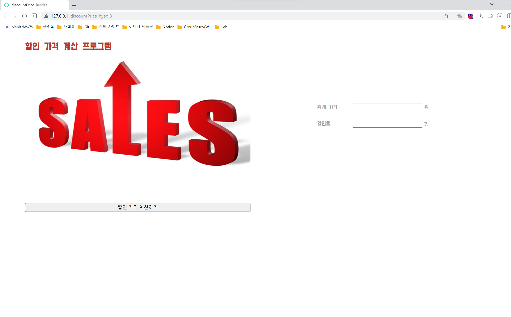
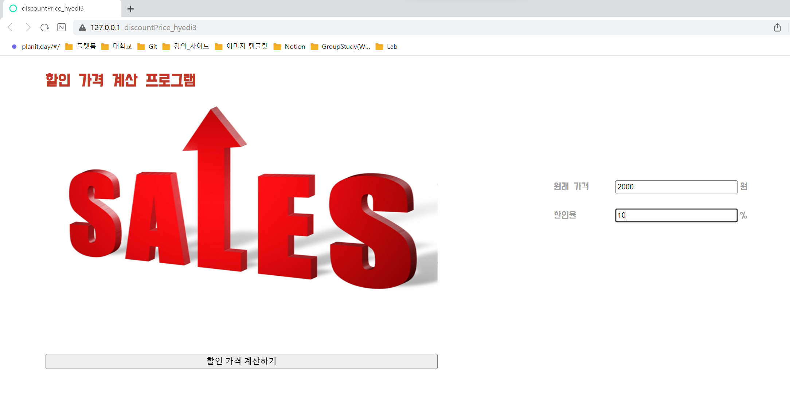
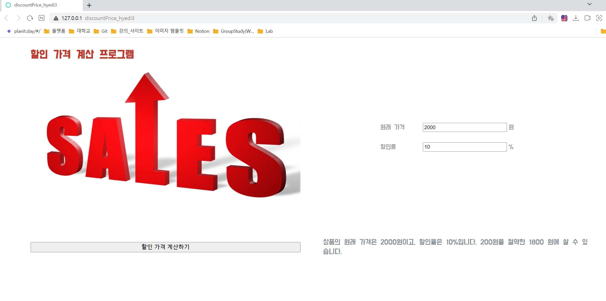

# 🚀 할인 가격 계산 프로그램 만들기
할인 가격 계산하기 버튼을 생성하고,원래 가격과 할인율을 사용자가 입력하고, 계산하기 버튼을 클릭시 자바스크립트가 작동되는 프로그램을 생성합니다.  <br>
<br>


## 🔑 discountPrice.html
**leftBox class**에는 할인 관련 `이미지를 배치`하고, **rightBox class**에는 `원래 물품 가격을 입력하는 input 란`과, `할인율을 입력하는 input 란`을 생성합니다. 원래 물품 가격과 할인율을 입력한 후, button class인 calcResult를 작동시키면 showResult class가 작동되게 페이지를 구성합니다.<br>

### 🤓 discountPrice.html 코드
```html
<!DOCTYPE html>
<html lang="en">
<head>
    <meta charset="UTF-8">
    <meta name="viewport" content="width=device-width, initial-scale=1.0">

    <title>discountPrice_hyedi3</title>
    
    <link rel="stylesheet" href="discountPrice.css" />
    <!-- 구글 무료 폰트 링크-->
    <link href="https://fonts.googleapis.com/css2?family=Do+Hyeon&family=Jua&family=Rubik&display=swap" rel="stylesheet">
</head>
<body>
    <div class="container">
        <div class="header">
            할인 가격 계산 프로그램
        </div>

        <div class="mainContainer">
            <div class="leftBox">
                
            </div>
            <div class="rightBox">
                <div class="currentPrice">
                    <p class="frontInput">원래 가격</p>
                    <input type="text"id="cPrice">
                    <p class="backInput">원</p>
                </div>
                <div class="sale">
                    <p class="frontInput">할인율</p>
                    <input type="text"id="rate">
                    <p class="backInput">%</p>
                </div>
            </div>
        </div>

        <div class="footer">
            <button class="calcResult"onclick="showPrice()">
                할인 가격 계산하기 
            </button>
            <div class="showResult"></div>
        </div>
    </div>

    <script src="discountPrice.js"></script>
</body>
</html>

```
<br>

## 🔑 discountPrice.css
-  컨테이너 클래스에 전체 페이지에 대한 default 속성 값을 지정해줍니다. 
-  **flex 속성**을 사용해서 화면에 맞게 프로그램이 유동적으로 변경되도록 만들어줍니다. (너무 픽셀이 어그러지지 않게 `justify-content: center;` & `align-items: center;`를 사용해 아이템 요소들을 중앙에 배치합니다.) 
-  **header**는 해당 `프로그램에 대한 제목을 배치`해주고 `화면 상단의 왼쪽에 배치`되게 지정합니다. 
-  **mainContainer** 안에 `leftBox 클래스`와 `rightBox 클래스`를 구분하여 제작
-  **leftBox 클래스**에는 `이미지를 배치`(이미지와 leftBox 클래스 요소의 크기를 동일시)
-  **rightBox 클래스**에는 `원래 가격을 입력하는 input란`과 `할인율을 계산하는 input란`을 배치합니다. 
-  input란을 기준으로 `앞에 텍스트`를 **frontInput 클래스**로 묶어주고, input란을 기준으로 `뒤에 텍스트`를 **backInput 클래스**로 묶어줍니다. 
-  **footer**는 `calcResult` 및 `showResult 클래스`를 묶는 **부모 컨테이너**입니다. 
-  **calcResult 클래스**는 **할인율을 계산하기 위한 버튼**으로 footer 왼쪽에 배치되게 합니다. (버튼의 너비는 이미지 너비와 동일하게 배치하고, 버튼 속 텍스트가 중앙에 배치되도록 `justify-content: center;` & `align-items: center;`를 사용합니다.)
-  **showResult 클래스**는 calcResult 클래스가 js에 의해 동작할 때 `footer 오른쪽에 출력`되도록 설정합니다. <br>

### 🤓 discountPrice.css 코드
```css
body {
    margin: 0;
    background-color: #fff;
  }

/* body 전체 컨테이너 속성 값 */
.container {
    width: 100vw;
    height: 100vh;
  
    display: flex;     
    flex-direction: column;   /* 아이템 요소 방향 세로(수직정렬) */
    align-items: center;   
    font-family: 'Do Hyeon', sans-serif;   /*구글 폰트 적용*/
  }

/* header 클래스 속성 값 */
.header {
    width: 90%;
    height: 10%;

    display: flex;
    flex-direction: row;    /* 아이템 요소들 가로(수평) 정렬 */
    align-items: center;    /* 아이템 요소 상하 위치를 가운데로 배치 */

    font-size: 30px;
    font-weight: bold;
    color: #C0392B;
}

/* leftBox와 rightBox를 묶는 전체 컨테이너 */
.mainContainer { 
    width: 90%;
    height: 38%;
    margin-bottom: 3vh;

    display: flex;
    flex-direction: row;    /* 아이템 요소들 가로(수평) 정렬 */
    align-items: center;    /* 아이템 요소 상하 위치를 가운데로 배치 */
    justify-content: space-between;  /* 아이템들의 “사이(between)”에 균일한 간격 생성 */
}
```
<br>

## 🔑 discountPrice.js
-  **showPrice**라는 `함수를 선언`합니다. (button onclick 속성에서 해당 함수를 불러올 예정) 
-  **cuurentPrice 변수를 선언**하고, `cPrice id 값을 html에서 가져와 변수에 저장`합니다. 
-  **rate 변수를 선언**하고, `rate id 값을 html에서 가져와 변수에 저장`합니다.
-  `savedPrice` : 입력된 원래 가격에 입력한 할인율을 100으로 나눈 값을 곱하면 총 할인된 가격이 반환됩니다. 
-  `resultPrice` : 현재 가격에서 할인된 가격을 뺀 결과값을 반환합니다. 
-  `document.querySelector(".showResult").innerHTML` : 선택자를 사용하여, (querySelector) class 값이 showResult인 태그(".showResult")를 선택하고 HTML에 삽입(innerHTML)합니다.  <br>

### 🤓 discountPrice.js 코드
```js
function showPrice( ) {
    var currentPrice = document.querySelector("#cPrice").value;   // 사용자가 입력한 원래 가격 
    var rate = document.querySelector("#rate").value;             // 사용자가 입력한 할인율

    var savedPrice = currentPrice * (rate/100);     // 할인 퍼센트를 100으로 나눈 후 현재 가격이랑 곱해서 할인된 가격을 반환
    var resultPrice = currentPrice - savedPrice;    // 현재 가격에 할인된 가격을 뺀 결과값 반환

    // 선택자를 사용하여, (querySelector) class 값이 showResult인 태그(".showResult")를 선택하고 HTML에 삽입(innerHTML)
    document.querySelector(".showResult").innerHTML = "상품의 원래 가격은 " + currentPrice + 
    "원이고, 할인율은 " + rate + "%입니다. " + savedPrice + "원을 절약한 " + resultPrice + 
    " 원에 살 수 있습니다.";
}
```
<br>

### 💻 결과화면
- `할인 가격 계산하기 버튼 클릭 전 웹페이지 화면` / `할인 가격 계산하기 버튼 클릭 후 웹페이지 화면` <br>
  <br>
  

<br></br>
