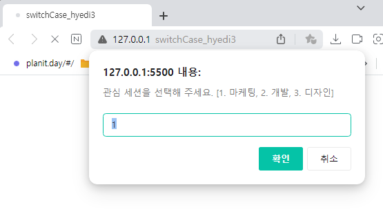
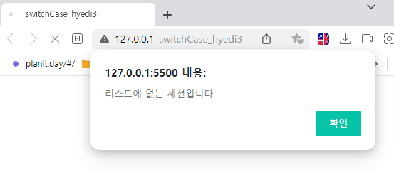
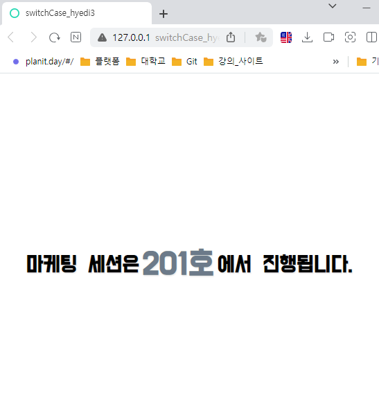
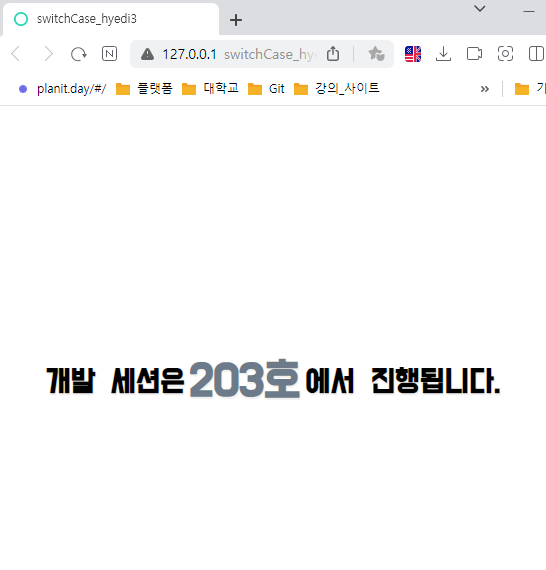
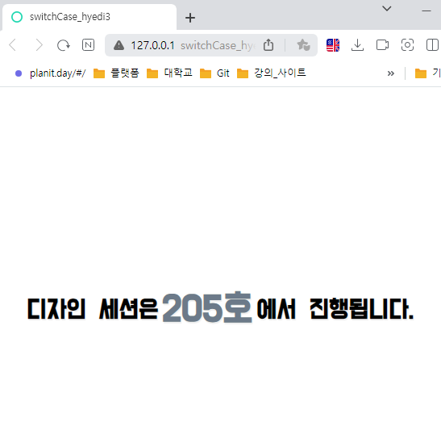

# 🚀  switchCase를 활용한 관심 세션 선택 프로그램
`사용자의 관심 분야를 프롬프트창에 입력`하면 해당 ***분야에 따라 서로 다른 강의실을 알려주는 프로그램을 개발***합니다.  <br>

- `기본  화면` / `값을 입력하지 않은 화면 (null 값)` <br>
  
<br></br>

## 🔑 switchCase.html
프롬프트에 사용자 입력값을 받은 후, 웹페이지에 값이 출력되게 할 result 클래스를 선언합니다. 
<br></br>

### 🤓switchCase.html 코드
```html
<!DOCTYPE html>
<html lang="en">
<head>
    <meta charset="UTF-8">
    <meta name="viewport" content="width=device-width, initial-scale=1.0">

    <title>switchCase_hyedi3</title>
    
    <link rel="stylesheet" href="switchCase.css">
    <!-- 구글 무료 폰트 링크-->
    <link href="https://fonts.googleapis.com/css2?family=Do+Hyeon&family=Jua&family=Rubik&display=swap" rel="stylesheet">

</head>

<body>
    <h1 class="result"> </h1>
    <script src="switchCase.js"> </script>
</body>

</html>
```
<br>

## 🔑 switchCase.css 
- `body` : ***배경색을 화이트로 처리***하고, ***너비와 높이를 100vw, 100vh로 설정***해 전체 웹페이지 너비를 지정해 줍니다. 폰트도 설정해주고, flex로 디스플레이를 설정해줍니다. ***모든 아이템 요소 방향을 수직 정렬 및 상하 위치를 가운데로 배치***합니다. 
 - `result 클래스` : *프롬프트에 값이 입력된 후 화면에 표현될 클래스*로, 너비는 90vh로, 높이는 100vh로 설정하고, ***아이템 요소들의 방향을 가로로 설정***합니다. 아이템들을 상하좌우 가운데로 배치하고, 폰트에 적용할 속성들을 지정합니다.
- `strong 클래스` : js 기능으로 ***const marketingSession = "201호";, const developSession = "203호";, const designSession = "203호"; 값들이 화면에 출력될 때*** *강조하기 위해 제작한 클래스*로, ***텍스트 색상을 청회색으로 지정***합니다.  <br>

### 🤓  switchCase.css 코드
```css
body {
	background-color: #fff;          /* 배경색상은 화이트  */
	color:#000;                              /* 텍스트 색상은 블랙  */

    width: 100vh;
    height: 100vh;

    display: flex;
    flex-direction: column;    /* 아이템 요소 방향 세로(수직정렬) */
    justify-content: center;    /* 아이템 요소 좌우 위치를 가운데로 정렬 */
    align-items: center;         /* 아이템 요소 상하 위치를 가운데로 배치 */

    font-family: 'Do Hyeon', sans-serif;   /*구글 폰트 적용 */
}

/*프롬프트에 값이 입력된 후 화면에 표현될 클래스 속성 지정 */
.result {
    width: 90%;
    height: 100%;

    display: flex;
    flex-direction: row;           /* 아이템 요소 방향 가로(수평정렬) */
    justify-content: center;     /* 아이템 요소 좌우 위치를 가운데로 정렬 */
    align-items: center;          /* 아이템 요소 상하 위치를 가운데로 배치 */

	font-size: 2em;                  /* 2em : 기본 px의 2배 */
	font-weight: 700;             /* 폰트 굵기 */
	text-shadow: 1px 2px 1px  #efefef;;
}

/* 201, 202, 203호가 텍스트로 화면에 출력될 때 속성 지정 */
.strong {
    height: 100%;
    margin: 0px 5px;             /* 상하 좌우 */

    display: flex;
    flex-direction: row;           /* 아이템 요소 방향 가로(수평정렬) */
    justify-content: center;     /* 아이템 요소 좌우 위치를 가운데로 정렬 */
    align-items: center;          /* 아이템 요소 상하 위치를 가운데로 배치 */

	font-size: 1.5em;             /* 2em : 기본 px의 2배 */
	font-weight: 700;            /* 폰트 굵기 */
	color: #6C7A89;         /* 청회색  */
}
```
<br>

## 🔑  switchCase.js
- `let displayArea = document.querySelector('.result');` : *result 클래스를 찾아와* ***displayArea 변수에 저장***합니다. 
- `let session = prompt("관심 세션을 선택해 주세요. [1. 마케팅, 2. 개발, 3. 디자인]","1");` : *사용자로부터 숫자를 입력받아* ***session 변수에 저장***합니다. (미리보기 숫자 1이 프롬프트창에 표출되게 지정합니다.)
- `case "1"` : *1을 입력할 경우*, html의 result 클래스 위치에 ***마케팅 세션이 201호에서 진행된다***는 멘트가 출력되게 구현합니다. 
- `case "2"` : *2을 입력할 경우*, html의 result 클래스 위치에 ***개발 세션이 203호에서 진행된다***는 멘트가 출력되게 구현합니다. 
- `case "3"` : *3을 입력할 경우*, html의 result 클래스 위치에 ***디자인 세션이 205호에서 진행된다***는 멘트가 출력되게 구현합니다. 
- `break` : *case 문 실행* 후 ***switch 문 탈출***합니다.
- `default` : ***case에 지정한 조건값과 일치하는 조건이 없을 때 실행***됩니다. (null 값에도 실행됨)
 <br>

### 🤓  switchCase.js 코드
```js
let displayArea = document.querySelector('.result');       // result 클래스를 찾아와 displayArea 변수에 저장합니다. 

let session = prompt("관심 세션을 선택해 주세요. [1. 마케팅, 2. 개발, 3. 디자인]", "1");        // 사용자로부터 숫자를 입력받아 session 변수에 저장합니다. (미리보기 숫자 1)
const marketingSession = "201호";
const developSession = "203호";
const designSession = "205호";

switch (session) {     // 사용자가 입력한 값 확인
    case "1":     // 1번을 입력할 경우 실행 
        displayArea.innerHTML = `마케팅 세션은 <span class="strong">${marketingSession}</span>에서 진행됩니다.`;
        break;     // case 문 실행 후 switch 문 탈출 

    case "2":      // 2번을 입력할 경우 실행 
        displayArea.innerHTML = `개발 세션은 <span class="strong">${developSession}</span>에서 진행됩니다.`;
        break;

    case "3":      // 3번을 입력할 경우 실행 
        displayArea.innerHTML = `디자인 세션은 <span class="strong">${designSession}</span>에서 진행됩니다.`;
        break;

    default:     // case에 지정한 조건값과 일치하는 조건이 없을 때 실행 
        alert("리스트에 없는 세션입니다.");
}
```
<br>

### 💻 결과화면
- `기본  화면` / `값을 입력하지 않은 화면 (null 값)` 
  <br>
  
<br></br>

- `'1'을 입력받은 화면` / `'2'를 입력받은 화면` <br>
  <br>
  
  <br></br>

- `'3'을 입력받은 화면` / `'4'를 입력받은 화면` <br>
  <br>
  
  <br></br>