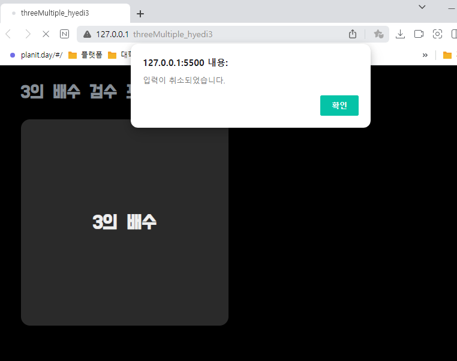

# 🚀 3의 배수 검수 프로그램 구현하기 
`사용자가 값을 프롬프트 창에 입력했는지 여부를 확인`하고, 입력한 값이 3의 배수인지 확인하여 ***3의 배수***일 경우, `${userNumber}은 3의 배수입니다.`를 출력하고, ***3의 배수가 아닐 경우*** `${userNumber}은 3의 배수가 아닙니다.`를 출력하는 프로그램을 구현합니다.  <br>


## 🔑 threeMultiple.html
 전체를 감싸는 container 클래스를 생성하여 `header 클래스`와 `mainContainer 클래스`를 묶습니다. 
 - `header`는 왼쪽 상단에 프로그램 로고로 표현하기 위한 클래스로 구성합니다. 
 - header 클래스 아래에 `mainContainer` 클래스를 배치하고, 해당 클래스 안에 leftBox 클래스와 rightBox 클래스를 생성합니다. 
<br></br>
 - `leftBox` 클래스에 ***h1 클래스***를 두고 ***몇 배수를 검수하는 프로그램인지 확인할 수 있게 배치***합니다. 
-  `rightBox 클래스`에는 ***result class를 자식클래스로 두고***, 클래스의 속성만 지정하고, 프롬프트값을 입력하기 전에는 어떠한 것도 표출되지 않게 숨깁니다.

### 🤓 threeMultiple.html 코드
```html
<!DOCTYPE html>
<html lang="en">
<head>
    <meta charset="UTF-8">
    <meta name="viewport" content="width=device-width, initial-scale=1.0">

    <title>threeMultiple_hyedi3</title>
    
    <link rel="stylesheet" href="threeMultiple.css" />
    <!-- 구글 무료 폰트 링크-->
    <link href="https://fonts.googleapis.com/css2?family=Do+Hyeon&family=Jua&family=Rubik&display=swap" rel="stylesheet">

</head>
<body>
    <div class="container">
        <div class="header">
            3의 배수 검수 프로그램
        </div>

        <div class="mainContainer">
            <div class="leftBox">
                <h1 class="title"> 3의 배수 </h1>
            </div>
            <div class="rightBox">
                <div class="result"></div> 
            </div>
        </div>
    </div>

    <script src="threeMultiple.js"></script>
</body>
</html>
```
<br>

## 🔑 threeMultiple.css 
- `body` : 기본 ***margin: 0;으로 여백을 없애고*** 배경색을 블랙으로 처리합니다. 
- `container 클래스` : ***너비와 높이를 100vw, 100vh로 설정***해 전체 웹페이지 너비를 지정해 줍니다. 폰트도 설정해주고, flex로 디스플레이를 설정해줍니다. 모든 아이템 요소 방향을 수직 정렬 및 상하 위치를 가운데로 배치합니다. 
- `header 클래스` : ***클래스의 너비를 90vh로 설정***해 양옆으로 10vh 여백을 주고, ***flex-direction: row;를 이용해 아이템 요소들을 수평 정렬***하고, ***align-items: center;를 이용해 아이템 요소들의 상하 위치를 가운데로 배치***합니다. 텍스트 색상은 ***color: #868e96; 청회색으로 지정***해줍니다. 
- `mainContainer 클래스` : leftBox와 rightBox 클래스를 묶는 전체 컨테이너로 ***클래스의 너비를 90vh로 설정해 양옆으로 10vh 여백을 주고***, ***flex-direction: row;를 이용해 leftBox와 rightBox 클래스를 수평 정렬하게 배치***합니다. ***align-items: center;를 이용해 leftBox와 rightBox 클래스를 상하 위치 가운데로 배치***합니다. ***justify-content: space-between;를 이용해 leftBox와 rightBox 클래스 사이에 균일한 간격을 생성***합니다. 
- `leftBox 클래스` : 왼쪽 컨테이너 클래스는 ***너비를 90vh의 48%를 차지하게 설정***하고, ***38vh 높이를 차지하게 설정***합니다. 해당 ***클래스의 배경색을 background-color: #2a2a2a; 진회색으로 지정***하고, ***테두리 둥글기를 15px로 설정***해 줍니다. 
- `title 클래스` : leftBox 클래스의 자식 클래스로, 부모 클래스의 너비와 너비를 그대로 물려받습니다. 
- `rightBox 클래스` : 오른쪽 컨테이너 클래스는 ***너비를 90vh의 48%를 차지하게 설정***하고, ***38vh 높이를 차지하게 설정***합니다. 
- `result 클래스` : rightBox 클래스의 자식 클래스로, 부모 클래스의 너비와 너비를 그대로 물려받습니다. ***텍스트 색상은 color: #a0a0a0; 회색으로 지정***합니다. js 기능에서 웹페이지 처음에는 출력되지 않고, 사용자가 프롬프트창에 값을 입력하면 텍스트가 표출되게 하는 클래스로 사용됩니다. <br>

### 🤓 threeMultiple.css 코드
```css
body {
    margin: 0;
    background-color: #000;
}

/* body 전체 컨테이너 속성 값 */ 
.container {
    width: 100vw;
    height: 100vh;
  
    display: flex;     
    flex-direction: column;   /* 아이템 요소 방향 세로(수직정렬) */
    align-items: center;   
    font-family: 'Do Hyeon', sans-serif;   /*구글 폰트 적용*/
  }

/* header 클래스 속성 값 */
.header {
    width: 90%;
    height: 10%;

    display: flex;
    flex-direction: row;    /* 아이템 요소들 가로(수평) 정렬 */
    align-items: center;    /* 아이템 요소 상하 위치를 가운데로 배치 */

    font-size: 30px;
    font-weight: bold;
    color: #868e96;
}

/* leftBox와 rightBox를 묶는 전체 컨테이너 */ 
.mainContainer { 
    width: 90%;
    height: 38%;
    margin-bottom: 3vh;

    display: flex;
    flex-direction: row;    /* 아이템 요소들 가로(수평) 정렬 */
    align-items: center;    /* 아이템 요소 상하 위치를 가운데로 배치 */
    justify-content: space-between;  /* 아이템들의 “사이(between)”에 균일한 간격 생성 */

}

/* 왼쪽 컨테이너 클래스 속성 */
.leftBox {
    width: 48%;
    height: 100%;

    display: flex;
    flex-direction: column;     /* 아이템 요소들 세로(수직) 정렬 */
   
    background-color: #2a2a2a;
    border-radius: 15px;

}

.title {
    width: 100%;
    height: 100%;

    display: flex;
    flex-direction: column;     /* 아이템 요소들 세로(수직) 정렬 */
    align-items: center;    /* 아이템 요소 상하 위치를 가운데로 배치 */
    justify-content: center;    /* 아이템 요소 좌우 위치를 가운데로 정렬 */
    
    color: #efefef;
}

/* 오른쪽 컨테이너 클래스 속성 */
.rightBox {
    width: 48%;
    height: 100%;

    display: flex;
    justify-content: center;    /* 아이템 요소 좌우 위치를 가운데로 정렬 */
    align-items: center;        /* 아이템 요소 상하 위치를 가운데로 배치 */
    flex-direction: column;     /* 아이템 요소들 세로(수직) 정렬 */
}

.result {
    width: 100%;
    height: 100%;

    display: flex;
    flex-direction: column;     /* 아이템 요소들 세로(수직) 정렬 */
    align-items: center;    /* 아이템 요소 상하 위치를 가운데로 배치 */
    justify-content: center;    /* 아이템 요소 좌우 위치를 가운데로 정렬 */
    
    font-size: 40px;
    color: #a0a0a0;
}
```
<br>

## 🔑 threeMultiple.js
- `window.addEventListener('DOMContentLoaded', function ()` : DOMContentLoaded 이벤트는 ***HTML 문서의 모든 요소들이 로드되고 파싱되었을 때 발생하는 이벤트리스너***입니다. 아래에 domReady 함수를 선언해주고, 해당 이벤트리스너 안에 domReady 함수를 호출해 DOMContentLoaded 이벤트가 발생했을 때 domReady() 함수를 호출합니다.
- `var displayArea = document.querySelector('.result'); ` : displayArea 변수를 선언하고, ***result 클래스를 찾아와 displayArea 변수에 저장***합니다. 
- `var userNumber = prompt("숫자를 입력하세요."); ` : ***prompt 함수를 사용해 사용자로부터 입력값을 받고***, 해당 **입력값을 userNumber 변수에 저장**합니다.
- `if (userNumber != null)` : 사용자 ***입력값이 null이 아니면 true를 반환하여 if문의 안의 조건이 실행***되고, ***null일 경우 false를 반환하여 else 조건문으로 이동하여 입력을 취소했다는 alert 알림창이 표출되게 구현***합니다.  
  > != (양옆의 값이 다른지 확인하는 연산자, 값이 달라야 true) 
-  `if (userNumber % 3 === 0)` : **사용자 입력값이 3으로 나눴을 때 나머지가 0이라면** ***3의 배수이므로 if문 안의 조건이 실행***되고, 그렇지 않을 경우, ***else 조건문으로 이동하여 else문 안의 조건이 실행***됩니다. 
 <br>

### 🤓 threeMultiple.js 코드
```js
// DOMContentLoaded 이벤트 :  HTML 문서의 모든 요소들이 로드되고 파싱되었을 때 발생하는 이벤트
window.addEventListener('DOMContentLoaded', function () {
    domReady();                   // DOMContentLoaded 이벤트가 발생했을 때 domReady() 함수를 호출합니다.
 });
 
 function domReady() {
     var displayArea = document.querySelector('.result');      // result 클래스를 찾아와 displayArea 변수에 저장합니다. 
     var userNumber = prompt("숫자를 입력하세요.");        // 사용자로부터 숫자를 입력받습니다. 
 
     if (userNumber != null) {                          // [확인]을 눌렀을 때 실행
 
         if (userNumber % 3 === 0) {                // 3의 배수일 때 실행
             displayArea.innerHTML = `${userNumber}은 3의 배수입니다.`;
         }
         else {                                                       // 3의 배수가 아닐 때 실행
             displayArea.innerHTML = `${userNumber}은 3의 배수가 아닙니다.`;
         }
     } 
     
     else {
         alert("입력이 취소되었습니다.")        // [취소]를 눌렀을 때 실행
     }
 }
```
<br>

### 💻 결과화면
- `웹페이지 로딩 후 첫 화면` / `입력 취소 화면` <br>
  <br>
  
<br></br>

- `30을 입력한 화면` / `30이 3의 배수일 경우 화면` <br>
  <br>
  
  <br></br>
  
- `25를 입력한 화면` / `25가 3의 배수가 아닐 경우 화면` <br>
  <br>
  
  <br></br>

- `null 값으로 확인을 누른 화면` <br>
  <br>
  